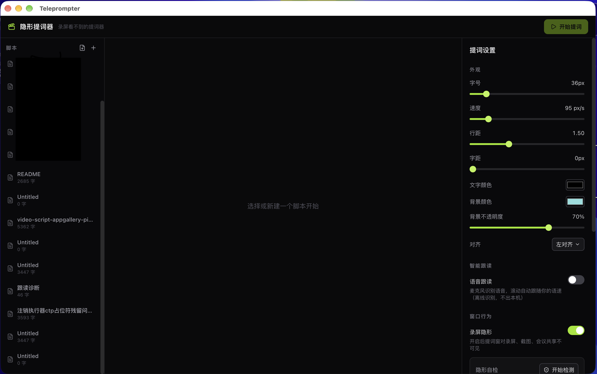
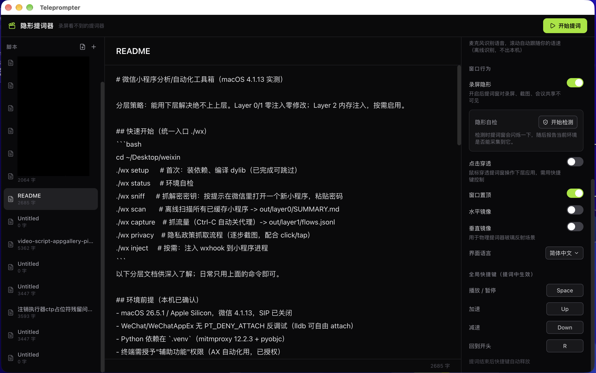
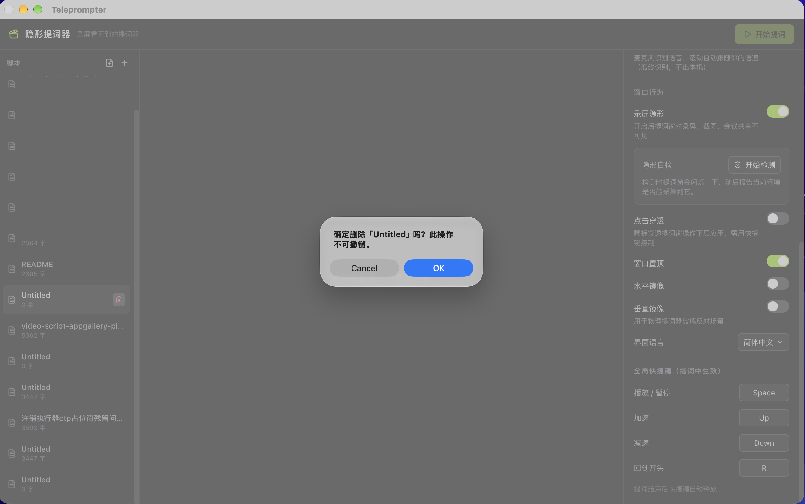

# 隐形提词器 Teleprompter

录口播视频时给你看的提词器 —— **屏幕录制、截图、会议共享都看不到它**。
对标芦笋提词器，支持 macOS / Windows / Linux。

- 录屏隐形：一键开关，`setContentProtection` 让提词窗对一切采集不可见
- 智能跟读：离线语音识别，滚动自动跟随语速，**识别全程在本机完成，语音不出本机**
- 技术栈：Electron + React + TypeScript + sherpa-onnx（离线 ASR）
- 平台：macOS（Apple Silicon / Intel）、Windows x64、Linux x86_64

## 软件截图

| 主界面：文稿列表 + 提词设置（外观/跟读/隐形） | 文稿编辑器：Markdown 自动剥离，上屏为纯口播文本 |
|:---:|:---:|
|  |  |

| 设置面板：隐形自检、点击穿透、镜像翻转、全局快捷键 | |
|:---:|:---:|
|  | |

## 功能

- **录屏隐形**：一键开关（`setContentProtection`），录制视频/截图时不含提词窗
- **隐形自检**：一键检测当前机器上提词窗是否真的对采集不可见
- **智能跟读**：离线语音识别（sherpa-onnx 中英双语流式模型），滚动自动跟随语速；识别不可用时自动回退匀速滚动
- **核心提词**：透明悬浮窗、置顶、无边框、可拖拽缩放、逐行高亮、匀速滚动
- **文稿导入**：支持导入 Markdown / TXT 文件（可多选），文件名作为标题
- **Markdown 显示**：提词窗自动剥离 markdown 语法（标题、加粗、列表、链接等），上屏为纯口播文本；编辑器保留原文
- **外观调节**：字号、速度、行距、字距、文字/背景颜色、背景不透明度、对齐
- **镜像翻转**：水平/垂直镜像，适配物理提词器玻璃反射
- **全局快捷键**：提词中生效（默认 Space 播放/暂停、↑↓ 调速、R 回到开头），可自定义
- **点击穿透**：鼠标穿透提词窗操作下层应用
- **中英双语**界面

## 下载

GitHub [Releases](https://github.com/taxiao213/teleprompter/releases) 提供四平台安装包
（打 `v*` tag 由 CI 自动构建发布）：

| 平台 | 产物 |
|------|------|
| macOS Apple Silicon | `teleprompter-v<版本>-macOS-arm64.dmg` |
| macOS Intel | `teleprompter-v<版本>-macOS-x86_64.dmg` |
| Windows x64 | `teleprompter-v<版本>-windows-x64-setup.exe` |
| Linux x86_64 | `teleprompter-v<版本>-linux-x64.AppImage` / `.tar.gz` 免安装包 |

> 首次打开提示「未受信任的开发者」（macOS）或 SmartScreen 拦截（Windows）：CI 产物未签名，
> macOS **右键 → 打开**，Windows 选「**仍要运行**」。

## 使用

1. 新建文稿，或点侧栏导入按钮导入 Markdown / TXT 文件
2. 选中文稿，点「开始提词」——提词窗出现，此时为**暂停**状态
3. 按 **Space**（或点播放键）开始滚动
4. 需要隐形时确认设置里「录屏隐形」已开启；录制前可用「隐形自检」一键体检

## 智能跟读

- 开启路径：设置 → 智能跟读。首次使用需在设置面板下载离线识别模型（约 200MB，ModelScope 源，国内可达）
- 模型文件存于 `userData/models/zipformer-bilingual/`，**识别全程在本机完成，语音不出本机**
- macOS 首次启用会请求麦克风权限，请点击「允许」
  - 若误点拒绝：设置面板会出现「打开系统设置」按钮，跳转到 隐私与安全性 → 麦克风 开启后**重启应用**
- 使用要点：跟读滚动只在**播放中**运行——开始提词后记得按 Space
- 停顿即停、回读自动倒退、跳读自动前进；连续识别不到时文本保持不动，不飘
- 模型未下载/引擎加载失败/麦克风被拒 → 自动回退为匀速滚动，跟读永不阻塞提词

## 平台兼容性说明（录屏隐形）

| 环境 | 隐形是否生效 |
|---|---|
| Windows 10 2004+（截图 / OBS / 会议软件） | ✅ 彻底消失 |
| macOS 系统截图、系统录屏、QuickTime | ✅ |
| OBS ≤ 29 / OBS「窗口采集」源 | ✅ |
| 浏览器网页版会议（getDisplayMedia） | ✅ |
| OBS 30+ 的「macOS 屏幕采集」源（macOS 15+） | ⚠️ 会被采集（Apple 平台限制） |
| 相机/摄像头直录 | ✅ 天然不受影响 |

macOS 15+ 使用 ScreenCaptureKit 的采集方会绕过系统级窗口保护（Electron 官方确认无解，
Apple 有意为之）。录制前请用应用内「隐形自检」确认当前环境，OBS 用户请改用「窗口采集」源。
注意：显示器休眠时自检无法采集屏幕，会提示找不到显示器，唤醒屏幕后重试即可。

## 从源码构建

```bash
pnpm install        # 首次安装（.npmrc 已配置 electron 国内镜像；pnpm-workspace.yaml 已配多平台架构）
pnpm dev            # 开发模式（HMR）
pnpm build          # 构建到 out/
pnpm typecheck      # 类型检查
pnpm test           # 单元测试（Vitest）
```

本地打包（脚本默认先跑 typecheck 和测试，`SKIP_INSTALL=1` / `SKIP_TESTS=1` 可跳过对应步骤，
额外参数透传给 electron-builder）：

```bash
bash scripts/build-mac.sh     # macOS：typecheck + 测试 + dmg（arm64 + x64）
bash scripts/build-win.sh     # 在 macOS 上交叉构建 Windows nsis x64
scripts\build-win.bat         # Windows 原生构建 nsis x64
```

打包需 Electron 下载镜像：`export ELECTRON_MIRROR=https://npmmirror.com/mirrors/electron/`（脚本已内置默认值）

## 发版流程（CI 自动构建）

1. 新建 `docs/release-notes/v<版本>.md` 写好本版 Release Notes（CI 以此作为 Release 正文）
2. 更新 `package.json` 的 `version`
3. 提交后打 tag：`git tag v<版本> && git push origin main --tags`
4. GitHub Actions 自动完成 测试 → 四平台打包 → 发布 Release（`.github/workflows/build.yml`）

## 技术说明

- 主进程为播放状态与设置的唯一事实源，双渲染窗口通过 IPC 广播保持同步；渲染进程全部运行
  在 sandbox 中，preload 按窗拆分最小权限 API
- sherpa-onnx 原生模块通过 `asarUnpack` 按平台解包，各平台包内不含其它平台二进制
- electron-vite 5 构建进度条在非 TTY stdout 会崩（`process.stdout.clearLine`），构建时通过
  `NODE_OPTIONS --require scripts/tty-polyfill.cjs` 注入 no-op（本地脚本与 CI 同一方案）

## 作者与联系

| 渠道 | 信息 |
|------|------|
| **作者** | taxiao |
| **微信公众号** | 他晓 |
| **邮箱** | yin13753884368@163.com |
| **CSDN** | <http://blog.csdn.net/yin13753884368/article> |
| **GitHub** | <https://github.com/taxiao213> |

> 💬 **进群交流**：扫码添加个人微信，回复「**他晓**」即可进群。

| 微信公众号「他晓」 | 个人微信（回复「他晓」进群） |
|:---:|:---:|
|  |  |
